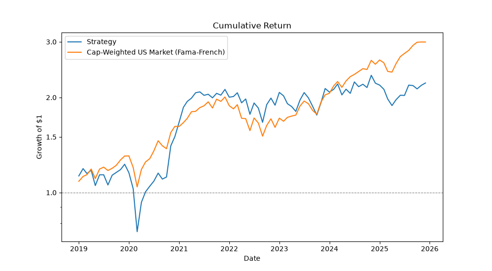

# Systemic-Tri-Factor-Risk-Premia-Trading-Engine
## Summary
This project is a composite trading engine which performs two major tasks in succession. First, it scans a point-in-time accurate version of the S&P 1500 index monthly over the period 2019-2025 for three risk-premium factors: market cap (recalculated monthly), year over year growth in total assets, and operating profitability (recalculated annually). The resulting metrics are converted to percentiles and then weighed equally to create a composite ranking of all stocks in the universe. Second, this codebase purchases the top quartile of those stocks and holds them in equal weight until the following month.

With this long-only investment portfolio created, this work also computes metrics and charts to analyze its results. 

## Results
**Table 1: FF5 Regression Results**

| Factor | Beta | p-value |
| --- | --- | --- |
| Alpha (monthly) | −0.0018 | 0.347 |
| Mkt-RF | 1.122 | <0.001 |
| SMB | 0.990 | <0.001 |
| HML | 0.210 | 0.001 |
| RMW | 0.245 | 0.004 |
| CMA | 0.281 | 0.003 |

R² = 0.957, n = 84 monthly observations.

The results of this portfolio regressed against FF5 (seen in table 1) indicate that no significant alpha was generated (p=0.347). Furthermore, the beta results for SMB (market cap), RMW (operating profitability), and CMA (change in year over year growth in total assets), all of which were significant, indicate that this screening effectively isolated those risk-premium factors, accounting for the returns generated.

**Graph 1: Cumulative Returns: Strategy vs. Cap-Weighted US market, 2019-2025**

The return of this portfolio net of fees underperformed relative to the broader equities market (measured as the MKT from Ken French's data library). This is true in terms of both returns (graph 1) and in terms of risk-adjusted performance. The return of this backtest was 11.86% annually (119.17% cumulative) compared to a return of 16.96% annually (199.48% cumulative) for the cap-weighted US market. On a risk adjusted basis, the portfolio created by this code had an annual volatility of 26.23% and a Sharpe Ratio of only 0.35, compared to a volatility of 17.26% annually and a Sharpe of 0.83 for the market.

Overall, the portfolio created monthly by screening for these factors failed to generate alpha and outperform the broader equities market. This result was expected as these factors are well documented in literature and require a long period of time to outperform. However, they are also a strong foundation for a more complex strategy, which is why they were selected when building this project. 

## Future Plans
This project can be used as the fundamental basis for a variety of future portfolios and/or trading strategies. The current factors can be augmented by further documented factors (i.e. value, momentum, quality, etc.). The companies returned by the screen can be researched and selected from to create a discretionary portfolio. Macroeconomic factors can be overlayed to determine market conditions. The stocks screened as meeting the requirements can be taken and traded daily, weekly, etc. by an algorithm scanning for further price action signals, underperformance, arbitrage opportunity, etc. 

I selected these factors for this initial project for that reason. While this strategy alone is not unique or profitable, it lays a foundation from which further strategies can be developed. I plan to attempt some of these modifications/augmentations in the future, as my coding abilities grow.

## Setup / How to Run
To run this backtester, a `.env` file is required. This file must have a variable for `EODHD_API_KEY`.

How to Run: There is a three step sequence to run this project. First, install the requirements (`pip install -r requirements.txt`). Second, run `python fetch_data.py` to populate a folder containing the required information from which the backtester runs. Third, run `python main.py`.

All outputs are derived from prices, fundamentals, and point-in-time constituents provided by EODHD.
